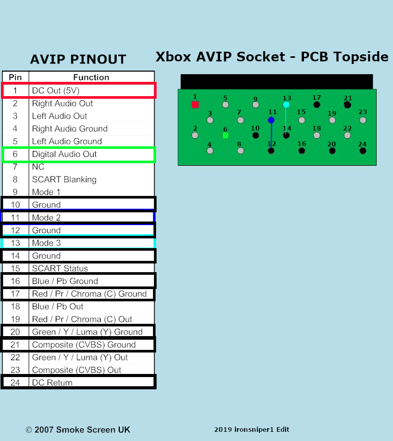

# CatponentX

This is a board that, in theory, allows for high quality component video output from the original Xbox. It replaces the AV Port, with a PCB that sticks out the back, providing high-quality analog video and digital audio output.

## Installation Instructions

These have only been tested on Xbox 1.0! Pads may differ on later Xbox revisions. 
Although, they should be the same on 1.1, but I believe 1.2-1.4 and 1.6 have different encoders, and likely a different board layout in that area.

### Y/Pb/Pr wires

(need an image)
1. Remove the inductors at L4A2, L4A3, and L4A3. They are above the video encoder, near the AV port. They're black and blue, and very big. Should be easy to remove with low-melt solder.
2. Solder 3 wires to the *bottom* pads (the one facing the video encoder chip). They should be long enough to go out the AV port. I personally used [this 3-core shielded wire](https://amazon.com/gp/product/B01LNH8POQ), to reduce interference.
3. Solder those wires to the Y/Pb/Pr pads on the CatponentX chip. I honestly forgot which one was which, so uh, if someone could figure that out, that'd be great.

### AV Port wires

You will need to solder 3 wires (5V, GND, and S/PDIF) to the A/V port holes here. They go to the appropiately labeled pads on the CatponentX PCB. Shielding is not needed.

You will also need to solder two jumpers between the Mode 2/Mode 3 holes, and the adjacent ground points. (Technically, ground is ground and it doesn't matter which ground you use, but it's just convienent to use the adjacent ground pins)

5V = Red  
GND = Black  
Green = S/PDIF  
Mode 2 = Dark Blue (solder to ground)  
Mode 3 = Light Blue (solder to ground)  

## Bill of Materials

| **References** | **Part Description**              | **Quanity** | **Price (Total)** | **Digi-Key**                                                                                                         |
| -------------- | --------------------------------- | ----------- | ----------------- | -------------------------------------------------------------------------------------------------------------------- |
| C1             | 10uF 16V Aluminum Capacitor       | 1           | $0.56             | [493-3913-1-ND](https://www.digikey.com/en/products/detail/nichicon/UCL1C100MCL1GS/2300262)                          |
| C2, C3         | 0.1uF 100V Ceramic Capacitor      | 1           | $0.20             | [1276-6840-1-ND](https://www.digikey.com/en/products/detail/samsung-electro-mechanics/CL21B104KCFNNNE/5961324)       |
| R1, R2, R3     | 75 Ohm 1/8W 0805 Resistor         | 3           | $0.30             | [CR0805-FX-75R0ELFCT-ND](https://www.digikey.com/en/products/detail/bourns-inc/CR0805-FX-75R0ELF/3740954)            |
| R4             | 160 Ohm 1/8W 0805 Resistor        | 1           | $0.10             | [118-CR0805-FX-1600ELFCT-ND](https://www.digikey.com/en/products/detail/bourns-inc/CR0805-FX-1600ELF/3784671)        |
| LED1           | Diffused Red 2V LED               | 1           | $0.39             | [754-1901-ND](https://www.digikey.com/en/products/detail/kingbright/WP914IDT)                                        |
| FILTER1        | THS7316DR Analog Video Filter/Amp | 1           | $1.01             | [296-26684-1-ND](https://www.digikey.com/en/products/detail/texas-instruments/THS7316DR/1905373)                     |
| RCA1           | 3 Component RCA Jacks             | 1           | $2.56             | [SC1854-ND](https://www.digikey.com/en/products/detail/switchcraft-inc/PJRAN3X1U03X/1288816)                         |
| TOSLINK1       | Optical S/PDIF Transmitter        | 1           | N/A               | [3185-FCR684208T-ND](https://www.digikey.com/en/products/detail/cliff-electronic-components-ltd/FCR684208T/15283099) |

**Note**: R4 and LED1 are optional if you don't want a power LED.

## Known Issues

- Video seems too bright (@Absolucy)
- S/PDIF output doesn't work for me (@Absolucy)
